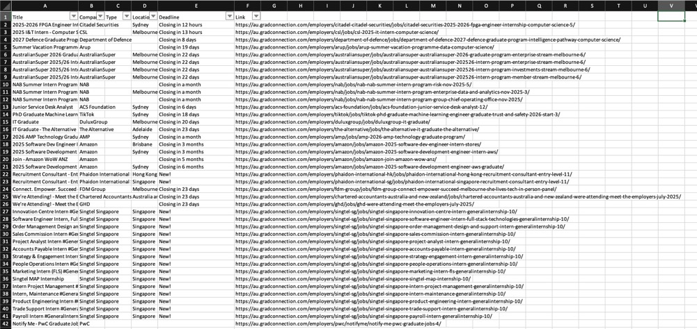

# GradConnection Job Scraper

A web crawler built with Scrapy framework to collect job listings from GradConnection Australia. This scraper specifically targets computer science jobs but can be easily customized to scrape jobs for any field.

## Features

- 🔍 Scrapes job listings from GradConnection Australia
- 📊 Extracts key job information: title, company, type, location, deadline, and link
- 🔧 Easily customizable for different job categories
- 📄 Exports data to various formats (JSON, CSV, XML)
- ⚡ Efficient pagination handling for complete data collection

## Project Structure

```
job/
├── spiders/
│   ├── gradconnection.py    # Main spider for GradConnection
│   └── prosple.py           # Additional spider for Prosple
├── items.py                 # Data structure definitions
├── pipelines.py             # Data processing pipelines
├── settings.py              # Scrapy configuration
├── middlewares.py           # Custom middlewares
└── README.md               # This file
```

## Data Fields

The scraper collects the following information for each job:

- **Title**: Job position title
- **Company**: Employer name
- **Type**: Job type (full-time, part-time, internship, etc.)
- **Location**: Job location
- **Deadline**: Application deadline
- **Link**: Direct link to the job posting

## Prerequisites

- Python 3.7+
- Scrapy framework

## Installation

1. Clone this repository:

```bash
git clone <your-repository-url>
cd job
```

2. Install required dependencies:

```bash
pip install scrapy
```

## Usage

### Basic Usage

Run the spider to scrape computer science jobs:

```bash
scrapy crawl gradconnection
```

### Export to Different Formats

Export scraped data to JSON:

```bash
scrapy crawl gradconnection -o jobs.json
```

Export to CSV:

```bash
scrapy crawl gradconnection -o jobs.csv
```

Export to XML:

```bash
scrapy crawl gradconnection -o jobs.xml
```

## Customization

### Change Job Category

To scrape jobs for a different field, modify the `start_urls` in `spiders/gradconnection.py`:

```python
# Current URL for computer science jobs
start_urls = ["https://au.gradconnection.com/jobs/computer-science/"]

# Example: Change to engineering jobs
start_urls = ["https://au.gradconnection.com/jobs/engineering/"]

# Example: Change to business jobs
start_urls = ["https://au.gradconnection.com/jobs/business/"]
```

### Available Job Categories

Common job categories on GradConnection include:

- `computer-science`
- `engineering`
- `business`
- `finance`
- `marketing`
- `law`
- `science`
- `healthcare`

### Modify Scraped Fields

To add or modify the data fields being scraped, update the `JobItem` class in `items.py`:

```python
class JobItem(scrapy.Item):
    title = scrapy.Field()
    company = scrapy.Field()
    type = scrapy.Field()
    location = scrapy.Field()
    deadline = scrapy.Field()
    link = scrapy.Field()
    # Add new fields here
    salary = scrapy.Field()
    description = scrapy.Field()
```

Then update the corresponding extraction logic in `spiders/gradconnection.py`.

## Configuration

### Settings

Key settings can be modified in `settings.py`:

- `CONCURRENT_REQUESTS`: Number of concurrent requests (default: 8)
- `ROBOTSTXT_OBEY`: Whether to obey robots.txt (default: False)
- `ITEM_PIPELINES`: Data processing pipelines

### Rate Limiting

To be respectful to the target website, consider adding delays between requests:

```python
# In settings.py
DOWNLOAD_DELAY = 2  # 2 seconds delay between requests
RANDOMIZE_DOWNLOAD_DELAY = 0.5  # 0.5 * to 1.5 * DOWNLOAD_DELAY
```

## Output Example

The scraper outputs data in the following format:

```json
{
  "title": "Software Engineer Graduate",
  "company": "Tech Company",
  "type": "Graduate Program",
  "location": "Sydney, NSW",
  "deadline": "Closing in 15 days",
  "link": "https://au.gradconnection.com/jobs/12345/"
}
```

### Sample Crawl Results

Here's an example of the actual scraped computer science job data:



_Example output showing scraped computer science job listings from GradConnection, including job titles, companies, locations, deadlines, and direct links to job postings._

## Legal and Ethical Considerations

- 🤖 Always respect the website's robots.txt file
- ⏱️ Implement appropriate delays between requests
- 📊 Use scraped data responsibly and in accordance with the website's terms of service
- 🔒 Do not overload the target server with excessive requests

## Troubleshooting

### Common Issues

1. **No data scraped**: Check if the website structure has changed
2. **Rate limiting**: Increase `DOWNLOAD_DELAY` in settings
3. **Connection errors**: Check your internet connection and target website availability

### Debug Mode

Run the spider in debug mode for troubleshooting:

```bash
scrapy crawl gradconnection -L DEBUG
```

## Contributing

1. Fork the repository
2. Create a feature branch
3. Make your changes
4. Add tests if applicable
5. Submit a pull request

## License

This project is for educational purposes. Please ensure compliance with GradConnection's terms of service and robots.txt before use.

## Disclaimer

This scraper is designed for educational and research purposes. Users are responsible for ensuring their use complies with the target website's terms of service and applicable laws.
